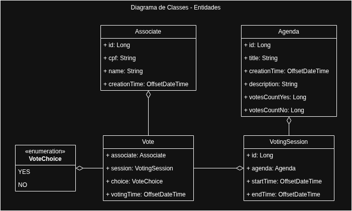

# Votação

## Objetivo

No cooperativismo, cada associado possui um voto e as decisões são tomadas em assembleias, por votação. Imagine que você deve criar uma solução para dispositivos móveis para gerenciar e participar dessas sessões de votação.
Essa solução deve ser executada na nuvem e promover as seguintes funcionalidades através de uma API REST:

- Cadastrar uma nova pauta
- Abrir uma sessão de votação em uma pauta (a sessão de votação deve ficar aberta por
  um tempo determinado na chamada de abertura ou 1 minuto por default)
- Receber votos dos associados em pautas (os votos são apenas 'Sim'/'Não'. Cada associado
  é identificado por um id único e pode votar apenas uma vez por pauta)
- Contabilizar os votos e dar o resultado da votação na pauta

Para fins de exercício, a segurança das interfaces pode ser abstraída e qualquer chamada para as interfaces pode ser considerada como autorizada. A solução deve ser construída em java, usando Spring-boot, mas os frameworks e bibliotecas são de livre escolha (desde que não infrinja direitos de uso).

É importante que as pautas e os votos sejam persistidos e que não sejam perdidos com o restart da aplicação.

O foco dessa avaliação é a comunicação entre o backend e o aplicativo mobile. Essa comunicação é feita através de mensagens no formato JSON, onde essas mensagens serão interpretadas pelo cliente para montar as telas onde o usuário vai interagir com o sistema. A aplicação cliente não faz parte da avaliação, apenas os componentes do servidor. O formato padrão dessas mensagens será detalhado no anexo 1.

## Como proceder

Por favor, **CLONE** o repositório e implemente sua solução, ao final, notifique a conclusão e envie o link do seu repositório clonado no GitHub, para que possamos analisar o código implementado.

Lembre de deixar todas as orientações necessárias para executar o seu código.

### Tarefas bônus

- Tarefa Bônus 1 - Integração com sistemas externos
  - Criar uma Facade/Client Fake que retorna aleátoriamente se um CPF recebido é válido ou não.
  - Caso o CPF seja inválido, a API retornará o HTTP Status 404 (Not found). Você pode usar geradores de CPF para gerar CPFs válidos
  - Caso o CPF seja válido, a API retornará se o usuário pode (ABLE_TO_VOTE) ou não pode (UNABLE_TO_VOTE) executar a operação. Essa operação retorna resultados aleatórios, portanto um mesmo CPF pode funcionar em um teste e não funcionar no outro.

```
// CPF Ok para votar
{
    "status": "ABLE_TO_VOTE
}
// CPF Nao Ok para votar - retornar 404 no client tb
{
    "status": "UNABLE_TO_VOTE
}
```

Exemplos de retorno do serviço

### Tarefa Bônus 2 - Performance

- Imagine que sua aplicação possa ser usada em cenários que existam centenas de
  milhares de votos. Ela deve se comportar de maneira performática nesses
  cenários
- Testes de performance são uma boa maneira de garantir e observar como sua
  aplicação se comporta

### Tarefa Bônus 3 - Versionamento da API

○ Como você versionaria a API da sua aplicação? Que estratégia usar?

## O que será analisado

- Simplicidade no design da solução (evitar over engineering)
- Organização do código
- Arquitetura do projeto
- Boas práticas de programação (manutenibilidade, legibilidade etc)
- Possíveis bugs
- Tratamento de erros e exceções
- Explicação breve do porquê das escolhas tomadas durante o desenvolvimento da solução
- Uso de testes automatizados e ferramentas de qualidade
- Limpeza do código
- Documentação do código e da API
- Logs da aplicação
- Mensagens e organização dos commits

## Dicas

- Teste bem sua solução, evite bugs
- Deixe o domínio das URLs de callback passiveis de alteração via configuração, para facilitar
  o teste tanto no emulador, quanto em dispositivos fisicos.
  Observações importantes
- Não inicie o teste sem sanar todas as dúvidas
- Iremos executar a aplicação para testá-la, cuide com qualquer dependência externa e
  deixe claro caso haja instruções especiais para execução do mesmo
  Classificação da informação: Uso Interno

## Anexo 1

### Introdução

A seguir serão detalhados os tipos de tela que o cliente mobile suporta, assim como os tipos de campos disponíveis para a interação do usuário.

### Tipo de tela – FORMULARIO

A tela do tipo FORMULARIO exibe uma coleção de campos (itens) e possui um ou dois botões de ação na parte inferior.

O aplicativo envia uma requisição POST para a url informada e com o body definido pelo objeto dentro de cada botão quando o mesmo é acionado. Nos casos onde temos campos de entrada
de dados na tela, os valores informados pelo usuário são adicionados ao corpo da requisição. Abaixo o exemplo da requisição que o aplicativo vai fazer quando o botão “Ação 1” for acionado:

```
POST http://seudominio.com/ACAO1
{
    “campo1”: “valor1”,
    “campo2”: 123,
    “idCampoTexto”: “Texto”,
    “idCampoNumerico: 999
    “idCampoData”: “01/01/2000”
}
```

Obs: o formato da url acima é meramente ilustrativo e não define qualquer padrão de formato.

### Tipo de tela – SELECAO

A tela do tipo SELECAO exibe uma lista de opções para que o usuário.

O aplicativo envia uma requisição POST para a url informada e com o body definido pelo objeto dentro de cada item da lista de seleção, quando o mesmo é acionado, semelhando ao funcionamento dos botões da tela FORMULARIO.

# desafio-votacao

## Solução do Desafio

Nesta sessão estará descrito o meu entendimento do problema, a forma como implementei e como executar a aplicação.

### Observações
- Não será implementada autenticação de acesso propositalmente, conforme solicitado no enunciado.
- A consulta de CPF será implementada na mesma aplicação, mas, em um cenário de produção, poderia ser um microsserviço separado.
- O formato esperado pela aplicação cliente não está muito claro no **Anexo 1**.
- Tanto o código quanto as rotas de API e payloads foram escritos em inglês.

### Lógica do Voto
Implementei a lógica do voto da seguinte forma:
- Registra o voto no banco de dados referenciando o associado, a pauta, a sessão e a escolha (SIM/NÃO).
- Incrementa, atomicamente, o total de votos SIM e total de votos NÃO na tabela da pauta.

Pensei nisso com o objetivo de evitar ter que contar todos os votos sempre que consultar a pauta. Assim o total já estará pronto ao consultar a pauta.

Esta abordagem também evita inconsistência nos totalizadores em casos de múltiplas instâncias da aplicação com votos simultâneos.

Claro que isso pode causar um gargalo de desempenho, em casos de muitos votos sendo registrados simultaneamente. Para solucionar isso vou descrever abaixo uma proposta para a **Tarefa Bônus 2 - Performance**.

### Requisitos Funcionais
- **RF-01**: Permitir o cadastro de associado. Como cada associado deve ser identificado por um ID único, o mesmo devará ser cadastrado previamente no sistema.
- **RF-02**: Permitir o cadastro de pautas. As pautas poderão receber votos SIM ou NÃO e contabilizar o total, permitindo consultar o resultado final.
- **RF-03**: Permitir a abertura de sessões. A votação somente pode acontecer se uma sessão estiver aberta, ou seja, entre a data/hora inicial e a data/hora final. Uma pauta poderá ter mais de uma sessão, mas apenas uma em aberto.
- **RF-04**: Permitir o voto do associado. Cada associado poderá votar apenas uma vez em cada pauta e apenas se uma sessão estiver aberta.

### Requisitos Não Funcionais
- **RNF-01**: API REST em Spring Boot 4.1.0 e Java 25.
- **RNF-02**: Persistência dos dados em PostgreSQL.
- **RNF-03**: Utilizar migrations para criação e alteração do banco de dados.
- **RNF-04**: Retornar dados em formato JSON.
- **RNF-05**: Validar o CPF em um serviço apartado.
- **RNF-06**: Não será utilizado credencias para autenticação. As chamadas da API deverão conter o ID do associado que está efetuando o voto.

### Modelagem
Modelei as principais classes de domínio conforme diagrama abaixo:



### Tarefa Bônus 1 - Validação do CPF

### Tarefa Bônus 2 - Performance

### Tarefa Bônus 3 - Versionamento da API
Atendendo ao requisito da **Tarefa Bônus 3**, o versionamento será feito no _path_ da URL, conforme exemplos abaixo:
```
/api/v1/agendas
/api/v1/associates
```
Esta abordagem me permite alterar versões em escopos específicos. Por exemplo: se eu precisar receber um payload de formato diferente para cadastrar uma pauta, poderia criar /api/v2/agendas.

O versionamento da rota também evita a quebra de integrações dos clientes. Quem chamar /api/v1/agendas vai continuar funcionando.


### Instruções

#### Execução
Para executar a aplicação crie um arquivo **.env**, conforme exemplo **.env.example**, na raiz do projeto. Use os valores que desejar para o nome do banco de dados, usuário e senha.

Execute o seguinte comando:
```
docker compose up --build
```

Ao executar o comando acima, uma instância do PostgreSQL e uma com a aplicação vão subir.

As tabelas serão criadas automaticamente pelo **flyway**, conforme arquivos de migrations.

#### Testes
Para executar os testes unitários execute o seguinte comando:
```
./gradlew test
```

#### Uso da API
Para acessar a documentação Swagger use esta URL: http://localhost:8080/swagger-ui/index.html

**Cadastrar uma Pauta**

```
POST http://localhost:8080/api/v1/agendas

Requisição:
{
  "title": "Teste Pauta",
  "description": "Teste de descrição de pauta."
}

Resposta:
{
    "id": 4,
    "title": "Teste Pauta",
    "description": "Teste de descrição de pauta.",
    "votesCountYes": 0,
    "votesCountNo": 0,
    "totalVotes": 0,
    "creationTime": "2026-07-05T17:37:05.879Z"
}
```

**Cadastrar um Associado**

```
POST http://localhost:8080/api/v1/associates

Requisição:
{
    "cpf": "12345678904",
    "name": "Teste Associado"
}

Resposta:
{
    "id": 4,
    "name": "Teste Associado",
    "cpf": "12345678904",
    "creationTime": "2026-07-06T16:53:28.097Z"
}
```

**Abrir uma Sessão de Votação**

```
POST http://localhost:8080/api/v1/agendas/{idPauta}/open-session

Requisição:
{
    "durationMinutes": 5
}

Resposta:
{
    "id": 11,
    "agenda": {
        "id": 2,
        "title": "Teste Pauta",
        "description": "Teste de descrição de pauta.",
        "votesCountYes": 0,
        "votesCountNo": 0,
        "totalVotes": 0,
        "creationTime": "2026-07-05T17:16:00.344Z"
    },
    "startTime": "2026-07-06T16:51:13.803Z",
    "endTime": "2026-07-06T16:56:13.803Z"
}
```

**Efetuar Voto**
```
POST http://localhost:8080/api/v1/agendas/{idPauta}/vote

Requisição:
{
    "associateId": 1,
    "choice": "YES"
}

Resposta:
{
    "session": {
        "id": 11,
        "agenda": {
            "id": 2,
            "title": "Teste Pauta",
            "description": "Teste de descrição de pauta.",
            "votesCountYes": 0,
            "votesCountNo": 0,
            "totalVotes": 0,
            "creationTime": "2026-07-05T17:16:00.344Z"
        },
        "startTime": "2026-07-06T16:51:13.803Z",
        "endTime": "2026-07-06T16:56:13.803Z"
    },
    "associate": {
        "id": 1,
        "name": "Teste Fornari",
        "cpf": "12345678901",
        "creationTime": "2026-07-05T18:09:29.895Z"
    },
    "choice": "YES",
    "votingTime": "2026-07-06T16:51:16.690Z"
}
```

**Consultar uma Pauta**
```
GET http://localhost:8080/api/v1/agendas/{idPauta}

Resposta:
{
    "id": 1,
    "title": "Teste Pauta",
    "description": "Teste de descrição de pauta.",
    "votesCountYes": 2,
    "votesCountNo": 0,
    "totalVotes": 2,
    "creationTime": "2026-07-05T16:38:17.254Z"
}
```